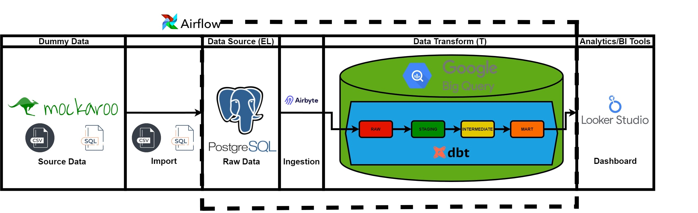
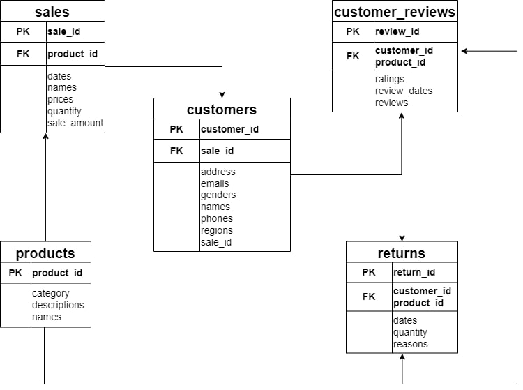
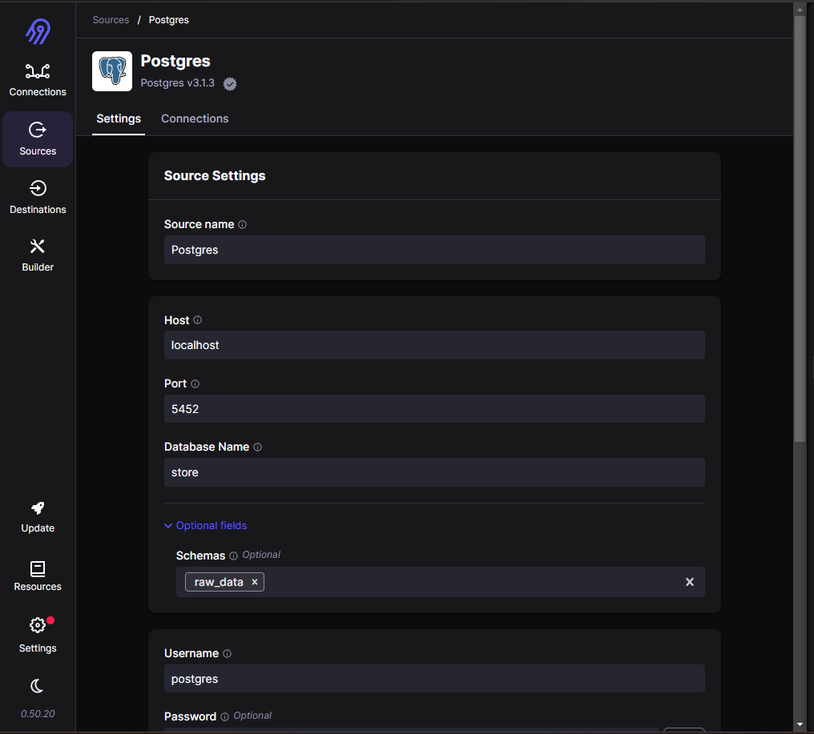
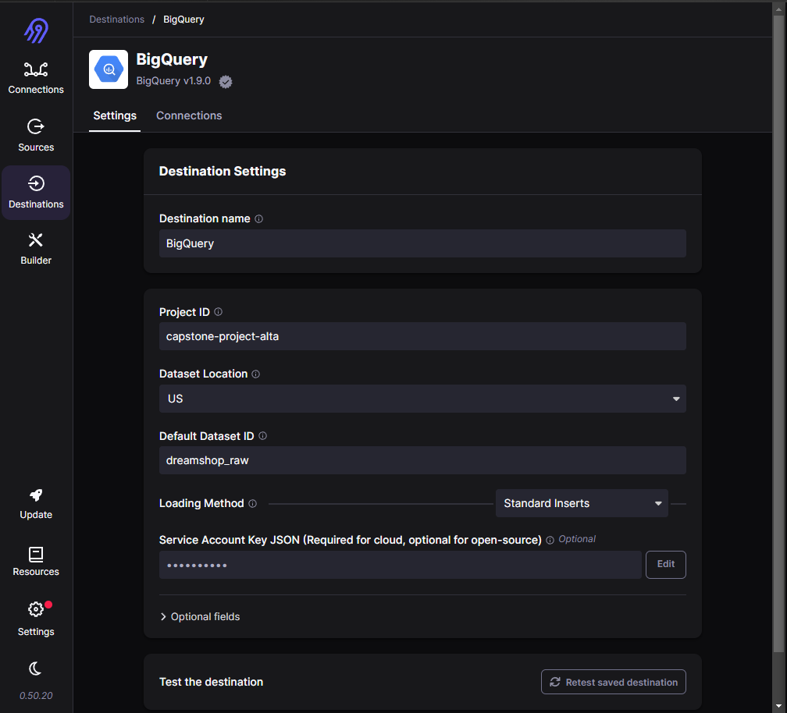
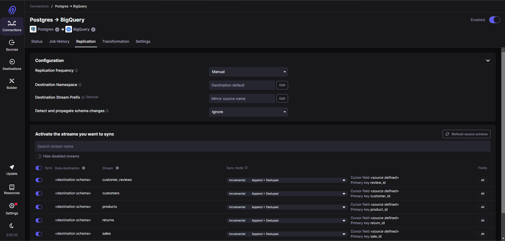
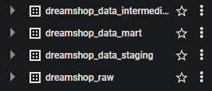
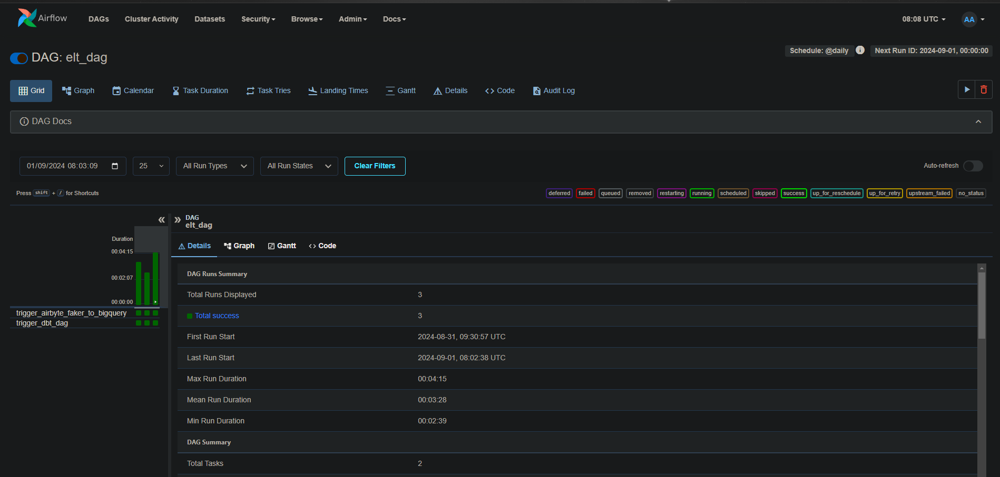

# Capstone-Project-ELT-Alta: ELT Pipeline Data Model for Product Performance Analysis
## Background Case
DreamShop, a rapidly growing e-commerce platform, has revolutionized the way customers shop online by offering a wide range of products, particularly in electronics and home appliances. As DreamShop continues to expand its product catalog and customer base, the company faces new challenges in understanding product performance, managing inventory, and enhancing customer satisfaction.

In an era where data-driven decisions are crucial, DreamShop's management has identified a critical need to harness the power of its data to stay competitive. With many transactions occurring daily, along with an ever-increasing volume of customer reviews and product returns, the company must develop an analytical approach to turn raw data into actionable insights.

The Challenge
DreamShop aims to optimize its product offerings by analyzing three key areas:
* Sales Performance: Understanding which products are driving revenue and which are lagging.
* Customer Feedback: Gaining insights into customer satisfaction, identifying common themes in feedback, and addressing areas of improvement.
* Product Returns: Monitoring return rates to identify products with potential quality issues or mismatched customer expectations.
These insights are crucial for DreamShop to make informed decisions about inventory management, marketing strategies, and product development. However, the sheer volume and complexity of the data present significant challenges. Data is scattered across multiple sources, including SQL databases and CSV files, each with its own format and inconsistencies.

The Vision
With this data pipeline, DreamShop envisions a future where data guides every decision. From identifying best-selling products to understanding why certain items are frequently returned, the insights generated will empower DreamShop to refine its inventory strategy, improve customer experiences, and drive overall business growth.

As DreamShop continues its journey to becoming a leader in the e-commerce space, this ELT pipeline is not just a technical implementation—it's a strategic initiative that will transform how the company operates, making it more agile, responsive, and customer-focused.

## Tools
To tackle these challenges, DreamShop has embarked on building a robust ELT (Extract, Load, Transform) data pipeline using cutting-edge tools:

* CSV and SQL (Data Source)
* PostgreSQL (Database)
* Airbyte: To seamlessly extract data from PostgreSQL databases and CSV files.
* BigQuery: As the central data warehouse, providing scalable storage and rapid querying capabilities.
* Data Build Tool (DBT): For transforming raw data into clean, structured formats that support in-depth analysis.
* Airflow: To orchestrate and automate the pipeline, ensuring data flows efficiently and reliably from extraction to visualization.
* Looker Studio: To create interactive dashboards that provide stakeholders with real-time insights into product performance.

## Data Pipeline Design
This data pipeline uses the ELT concept.


## ERD
<<<<<<< HEAD

=======

>>>>>>> ce333024c78db4ea3ef68cebccbe4ad7d953349a

## Clone This Repository
```
git clone https://github.com/Fiqar-DE4/Team-1-Alta-Capstone-ELT.git
```
## Ingesting data on Airbyte
Run docker [compose-airbyte](airbyte/docker-compose-airbyte.yml) to use airbyte
Then open `localhost:8000` to access Airbyte.
```
Username: airbyte
Password: password
```
Create your source.



Create your destination.



Connect your data source with your data destination on Airbyte. At this stage you can schedule the data load.



## Data Modeling on DBT
### Install using pip and virtual environments
Create new venv
```
python -m venv dbt_venv              # create the environment
```
Activate virtual environment         
```
dbt_venv\Scripts\activate            # activate the environment for Windows
```
### Install and Setup DBT
Install dbt-bigquery
```
python -m pip install dbt-bigquery
```
Run dbt cli to init dbt with BigQuery as data platform
```
dbt init my_dbt_project
```
Testing dbt connection. Make sure you are in your DBT project directory when testing the connection
```
dbt debug
```
Setup DBT Project configuration
```
models:
  analys:
    stg:
      +enabled: true
      +materialized: table
      +schema: staging
    int:
      +enabled: true
      +materialized: table
      +schema: intermediate   
    mart:
      +enabled: true
      +materialized: table
      +schema: mart
```
Defining Source and creating your a Model
```
version: 2 
sources:
  - name: dreamshop_raw
    database: capstone-project-alta
    schema: dreamshop_raw
    tables: 
      - name: products
        description: "Table containing raw products data"
      - name: sales
        description: "Table containing raw sales data"
      - name: returns
        description: "Table containing raw returns data"
      - name: customers
        description: "Table containing raw customers data"
      - name: customer_reviews
        description: "Table containing raw customer_reviews data"

version: 2
models:
  - name: stg_customer_reviews
    description: "This table stores customer reviews for products."
    columns:
      - name: review_id
        description: "Unique ID for each review."
        data_type: "integer"
        data_tests:
          - not_null
          - unique
      - name: product_id
        description: "ID of the product being reviewed."
        data_type: "integer"
        data_tests:
          - not_null
      - name: customer_id
        description: "ID of the customer who provided the review."
        data_type: "integer"
        data_tests:
          - not_null
      - name: review_dates
        description: "The date the review was submitted."
        data_type: "date"
        data_tests:
          - not_null
      - name: product_ratings
        description: "The rating given by the customer (1-5)."
        data_type: "integer"
        data_tests:
          - not_null
      - name: product_reviews
        description: "The text of the review provided by the customer."
        data_type: "varchar"
        data_tests:
          - not_null

  - name: stg_customers
    description: "This table stores customer information."
    columns:
      - name: customer_id
        description: "Unique ID for each customer."
        data_type: "integer"
        data_tests:
          - not_null
          - unique
      - name: customer_names
        description: "The full name of the customer."
        data_type: "varchar"
        data_tests:
          - not_null
      - name: customer_genders
        description: "The gender of the customer."
        data_type: "varchar"
        data_tests:
          - not_null
      - name: customer_emails
        description: "The email address of the customer."
        data_type: "varchar"
        data_tests:
          - not_null
          - unique
      - name: normalized_phone
        description: "The normalized phone number of the customer."
        data_type: "varchar"
        data_tests:
          - not_null
      - name: customer_address
        description: "The address of the customer."
        data_type: "varchar"
        data_tests:
          - not_null
      - name: region
        description: "The region or geographical area of the customer."
        data_type: "varchar"
        data_tests:
          - not_null

  - name: stg_products
    description: "This table stores information about the products being sold."
    columns:
      - name: product_id
        description: "Unique ID for each product."
        data_type: "integer"
        data_tests:
          - not_null
          - unique
      - name: product_category
        description: "The category of the product."
        data_type: "varchar"
        data_tests:
          - not_null
      - name: product_names
        description: "The name of the product."
        data_type: "varchar"
        data_tests:
          - not_null
      - name: product_descriptions
        description: "A description of the product."
        data_type: "varchar"
        data_tests:
          - not_null

  - name: stg_returns
    description: "This table stores information about product returns by customers."
    columns:
      - name: return_id
        description: "Unique ID for each return."
        data_type: "integer"
        data_tests:
          - not_null
          - unique
      - name: product_id
        description: "ID of the product being returned."
        data_type: "integer"
        data_tests:
          - not_null
      - name: return_dates
        description: "The date the product was returned."
        data_type: "date"
        data_tests:
          - not_null
      - name: return_qty
        description: "The quantity of products being returned."
        data_type: "integer"
        data_tests:
          - not_null
      - name: return_reason
        description: "The reason for the product return."
        data_type: "varchar"
        data_tests:
          - not_null

  - name: stg_sales
    description: "This table stores information about product sales."
    columns:
      - name: sale_id
        description: "Unique ID for each sale."
        data_type: "integer"
        data_tests:
          - not_null
          - unique
      - name: product_id
        description: "ID of the product being sold."
        data_type: "integer"
        data_tests:
          - not_null
      - name: product_names
        description: "The name of the product being sold."
        data_type: "varchar"
        data_tests:
          - not_null
      - name: sale_dates
        description: "The date the sale occurred."
        data_type: "date"
        data_tests:
          - not_null
      - name: sale_qty
        description: "The quantity of products sold."
        data_type: "integer"
        data_tests:
          - not_null
      - name: sale_prices
        description: "The price per unit of the product sold."
        data_type: "numeric"
        data_tests:
          - not_null
      - name: total_sales
        description: "The total amount of the sale."
        data_type: "numeric"
        data_tests:
          - not_null
```
### Run and test your model
Once you create a model, you can then run your model
```
dbt run
dbt test
```
### Results after creating the model
This is the result on your bigquery after running dbt successfully




## DBT Automation with Airflow
Before running the Astro CLI, ensure you [download](https://github.com/astronomer/astro-cli/releases) the installer and add its path to your local environment variables.

<b>Create an Astro Project</b>
</br>
To create a new Astro project, use the command:
```
astro dev init
```
This command sets up all necessary project files for running Airflow locally, including example DAGs that you can immediately execute.

<b>Run Airflow Locally</b>
</br>
To run Airflow locally, first, add the following command to your [dockerfile](dbt/analys/Dockerfile).
```
RUN python -m venv dbt_venv && source dbt_venv/bin/activate && \
    pip install --no-cache-dir dbt-bigquery==1.7.6 && deactivate
```
To start your Airflow environment locally, navigate to your project directory and run:
```
astro dev start
```
Once the project builds successfully, you can access the Airflow UI in your browser at https://localhost:8080/ using the following credentials:
```
username : airflow
password : airflow
```

<b>Creating DAGs for Data Modelling</b>
</br>
Navigate to the dags directory and create a file named ELT_Dreamshop.py to set up your pipeline from extraction, load and dbt automation and scheduling tasks.
```
from pendulum import datetime
from airflow.decorators import dag, task, task_group
from airflow.operators.trigger_dagrun import TriggerDagRunOperator
from airflow.providers.airbyte.operators.airbyte import AirbyteTriggerSyncOperator
from airflow.models.baseoperator import chain
from cosmos import DbtDag
from cosmos.operators import DbtDocsOperator
from cosmos.config import RenderConfig
from cosmos.airflow.task_group import DbtTaskGroup
from cosmos.constants import LoadMode
from dbt.analys.cosmos_config import DBT_CONFIG, DBT_PROJECT_CONFIG

AIRBYTE_CONN_ID = 'bdad854c-cacf-4ffb-b962-3fb4be38bfdd'

# Define the ELT DAG
@dag(
    dag_id="elt_dag",
    start_date=datetime(2024, 1, 1),
    schedule="@daily",
    tags=["airbyte", "dbt", "bigquery", "elt_dreamshop_data"],
    catchup=False,
)
def extract_and_transform():
    """
    Runs the connection "Faker to BigQuery" on Airbyte and then triggers the dbt DAG.
    """
    # Airbyte sync task
    extract_data = AirbyteTriggerSyncOperator(
        task_id="trigger_airbyte_faker_to_bigquery",
        airbyte_conn_id='airbyte_conn',
        connection_id=AIRBYTE_CONN_ID,  # Menggunakan konstanta yang sudah didefinisikan
        asynchronous=False,
        timeout=3600,
        wait_seconds=3
    )

    # Trigger for dbt DAG
    trigger_dbt_dag = TriggerDagRunOperator(
        task_id="trigger_dbt_dag",
        trigger_dag_id="dbt_dreamshop",
        wait_for_completion=True,
        poke_interval=30,
    )

    extract_data >> trigger_dbt_dag

# Instantiate the ELT DAG
extract_and_transform_dag = extract_and_transform()

# Define the dbt DAG using DbtDag from the cosmos library
dbt_cosmos_dag = DbtDag(
    dag_id="dbt_dreamshop",
    start_date=datetime(2024, 1, 1),
    tags=["dbt", "dreamshop"],
    catchup=False,
    project_config=DBT_PROJECT_CONFIG,
    profile_config=DBT_CONFIG,
    render_config=RenderConfig(
        load_method=LoadMode.DBT_LS,
        select=["path:models"]
    )
)

# Instantiate the dbt DAG
dbt_cosmos_dag
```

<b>Detailed Explanation</b>
</br>
<b>Import Statements:</b>
</br>
* from pendulum import datetime: Imports the datetime function from the Pendulum library for handling date and time operations.
* from airflow.decorators import dag, task, task_group: Imports decorators to define DAGs, tasks, and task groups in Airflow.
* from airflow.operators.trigger_dagrun import TriggerDagRunOperator: Imports an operator that triggers another DAG within Airflow.
* from airflow.providers.airbyte.operators.airbyte import AirbyteTriggerSyncOperator: Imports an operator specifically for triggering data syncs in Airbyte.
* from airflow.models.baseoperator import chain: Imports a utility function to chain multiple tasks together in a sequence.
* from cosmos import DbtDag: Imports DbtDag, which is used to define dbt-specific DAGs using the Cosmos framework.
* from cosmos.operators import DbtDocsOperator: Imports an operator for generating dbt documentation.
* from cosmos.config import RenderConfig: Imports configuration settings for rendering dbt models in DAGs.
* from cosmos.airflow.task_group import DbtTaskGroup: Imports task groups for organizing dbt-related tasks within Airflow.
* from cosmos.constants import LoadMode: Imports constants that define load modes for dbt tasks.
* from dbt.analys.cosmos_config import DBT_CONFIG, DBT_PROJECT_CONFIG: Imports configurations specific to the dbt project.

<b>Constants:</b>
</br>
AIRBYTE_CONN_ID = 'bdad854c-cacf-4ffb-b962-3fb4be38bfdd': Defines a constant that holds the connection ID for Airbyte, which will be used for data extraction.

<b>Defining the ELT DAG:</b>
</br>
* @dag(...): A decorator that defines a new DAG called extract_and_transform.
* dag_id="elt_dag": Sets the unique identifier for the DAG.
* start_date=datetime(2024, 1, 1): Specifies the start date for the DAG.
* schedule="@daily": Sets the schedule for the DAG to run daily.
* tags=["airbyte", "dbt", "bigquery", "elt_dreamshop_data"]: Tags the DAG for easy identification and filtering in the Airflow UI.
* catchup=False: Disables backfilling of the DAG, meaning it won’t run for any missed dates in the past.

<b>DAG Function: extract_and_transform():</b>
</br>
* This function defines the tasks that will run within the DAG.
* Airbyte Sync Task:
    * extract_data = AirbyteTriggerSyncOperator(...): Creates a task to trigger data extraction using Airbyte.
    * task_id="trigger_airbyte_faker_to_bigquery": Sets the task ID for easy identification.
    * airbyte_conn_id='airbyte_conn': References the Airbyte connection used for syncing data.
    * connection_id=AIRBYTE_CONN_ID: Uses the predefined constant to identify the specific Airbyte connection.
    *  asynchronous=False: Sets the task to run synchronously, meaning it waits for the sync to complete before proceeding.
    * timeout=3600: Sets a maximum timeout of 1 hour for the sync operation.
    * wait_seconds=3: Sets the wait time between sync checks to 3 seconds.

<b>Trigger dbt DAG Task:</b>
</br>
* trigger_dbt_dag = TriggerDagRunOperator(...): Creates a task to trigger the dbt DAG.
* task_id="trigger_dbt_dag": Sets the task ID for easy identification.
* trigger_dag_id="dbt_dreamshop": Specifies the ID of the DAG that this task will trigger.
* wait_for_completion=True: Waits for the triggered DAG to complete before proceeding.
* poke_interval=30: Sets the interval to check for the completion of the triggered DAG.
* extract_data >> trigger_dbt_dag: Defines the task sequence, ensuring that the dbt DAG only runs after the Airbyte sync is complete.

<b>Instantiate the ELT DAG:</b>
</br>
extract_and_transform_dag = extract_and_transform(): Instantiates the DAG defined by the extract_and_transform function.

<b>Define the dbt DAG using Cosmos:</b>
</br>
* dbt_cosmos_dag = DbtDag(...): Defines a new DAG specifically for dbt using the DbtDag class from the Cosmos library.
* dag_id="dbt_dreamshop": Sets the DAG ID for the dbt pipeline.
* start_date=datetime(2024, 1, 1): Specifies when the DAG should start running.
* tags=["dbt", "dreamshop"]: Tags the DAG for easy filtering.
* catchup=False: Disables backfilling for missed runs.
* project_config=DBT_PROJECT_CONFIG: Uses the imported dbt project configuration.
* profile_config=DBT_CONFIG: Uses the imported dbt profile configuration.
* render_config=RenderConfig(...): Configures how dbt models are loaded and executed.
* load_method=LoadMode.DBT_LS: Specifies the load method to use with dbt.
* select=["path:models"]: Indicates which models to run.

<b>Instantiate the dbt DAG:</b>
</br>
* dbt_cosmos_dag: Instantiates the DAG created for the dbt pipeline, making it ready to be scheduled and run.


<b>Triger DAG</b>
</br>
You can trigger the DAG and monitor its progress in the Airflow UI.



## Marketing campaign analysis visualization
The visualizations were created using Looker Studio, which provides insights into marketing campaign performance. You can view the visualization [here](https://lookerstudio.google.com/reporting/66e680ba-6d01-48d3-bb45-c7b8ef13227b/page/AfaAE).

